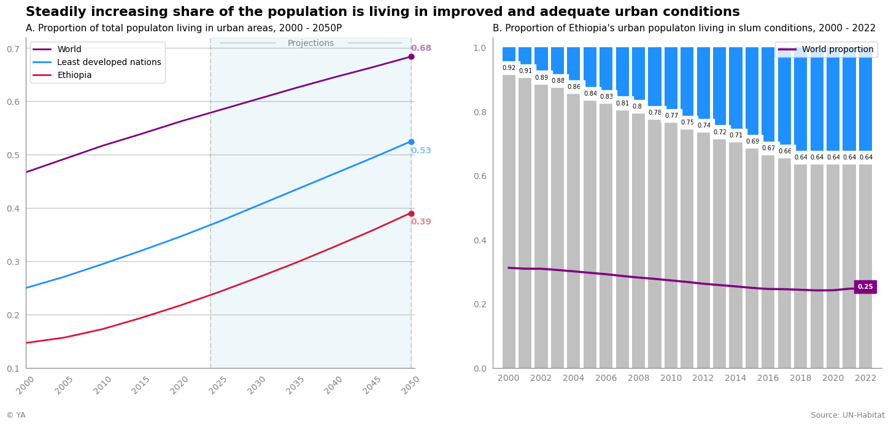
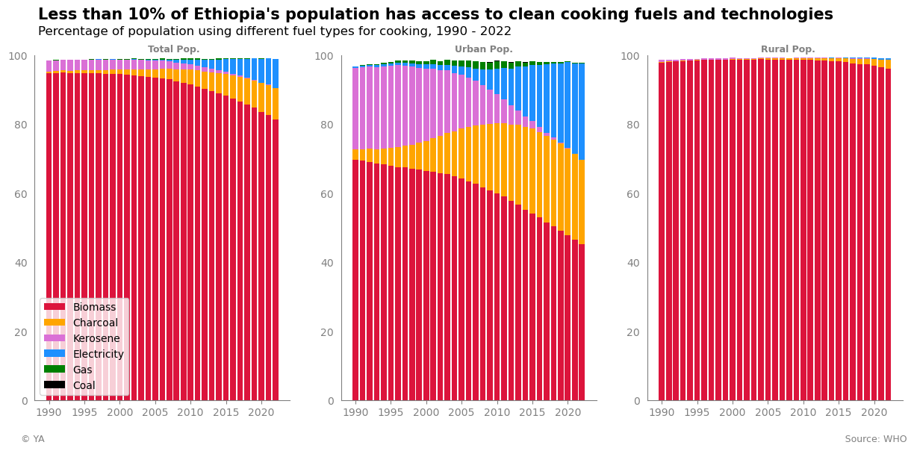

# Analyzing Air Pollution and Associated Burden of Disease in Ethiopia

## Introduction

This Python data project aims to examine air pollution exposure and its associated burden of disease in Ethiopia, especially in the context of urbanization, by addressing the three main questions below: 

1. **How has Ethiopia's population trended over time and geographically, especially in the context of urbanization?**
   
2. **What is the air pollution exposure in the country, both outside and in households? How has this changed historically?**
   
3. **What is the associated burden of disease caused by air pollution in Ethiopia? Have health outcomes improved or worsened?**

**Public Health and Policy Use Case:**

The project ultimately seeks to provide data-informed policy and investment directions for the developing nation. In understanding where pollution exposure is highest, why that might be the case, and what impact it has on public health, policy directives and fund allocations can be more effectively geared to tackle air pollution in the country.

## Key Findings

The project analyses highlighted important trends with regard to urbanization and demographic settlement, outdoor and indoor air pollution exposure, and associated health outcomes.

**Identified areas of focus for policy and investment:**

- Low urbanization rate and high urban slum rate
- Unsafe ambient air quality exasperated by emissions from an aged vehicle fleet
- High exposure to household pollution due to limited access to clean cooking fuels and technologies

**Highight Visualizations**

**PowerPoint Presentation - Summarized Results:**

[Air Pollution in Ethiopa - Short Form](https://github.com/Yishak-Ali/Air-Pollution-in-Ethiopia/blob/main/Air%20Pollution%20in%20Ethiopia%20-%20Short%20Form.pptx)

## Prerequisite

Python with the following libraries:

- pandas
- geopandas
- numpy
- matplotlib
- shapely
- linearmodels

## Data Sources

The [datasets](https://github.com/Yishak-Ali/Air-Pollution-in-Ethiopia/tree/main/Data) used for this project are all publicly accessible and can be found along with any available documentation below:

1) [Annual Population Estimates - UN Population Fund](https://pdp.unfpa.org/?_ga=2.228984607.246803807.1734063039-200135835.1734063039&country=231&data_id=dataSource_8-6%3A75%2CdataSource_8-1%3A2%2B10%2B11%2CdataSource_8-2%3A727%2CdataSource_8-5%3A2849&page=Explore-Indicators)
2) [World Population Rate of Change - UN DESA](https://population.un.org/dataportal/data/indicators/51/locations/900/start/1980/end/2023/table/pivotbylocation?df=9468e38c-482d-4a1c-82b8-a5672388c740)
3) [Mortality & Fertility Rates - World Bank](https://databank.worldbank.org/source/world-development-indicators#)
4) [Urbanization Rate - UN Habitat](https://data.unhabitat.org/pages/urban-population-and-demographic-trends)
5) [Urban Slums Rate - UN Habitat](https://data.unhabitat.org/pages/housing-slums-and-informal-settlements)
6) [Spatial Population Density - WorldPop](https://hub.worldpop.org/geodata/listing?id=77)
7) [Major City Coordinates - Simple Maps](https://simplemaps.com/data/et-cities)
8) [By Residential Area PM2.5 Estimates - WHO](https://www.who.int/data/gho/data/indicators/indicator-details/GHO/concentrations-of-fine-particulate-matter-(pm2-5))
9) [By Region PM2.5 Estimates - UN Habitat](https://data.unhabitat.org/pages/urban-environment-and-quality-of-life)
10) [Spatial PM2.5 Concentration - EPA & 2013 GBD Study](https://www.epa.gov/benmap/benmap-ce-regional-datasets)
11) [Addis Ababa US Embassy PM2.5 Recordings - EPA](https://www.airnow.gov/international/us-embassies-and-consulates/#Ethiopia$Addis_Ababa_Central)
12) [Household Fuel Use - WHO](https://www.who.int/data/gho/data/indicators/indicator-details/GHO/proportion-of-population-with-primary-reliance-on-fuels-and-technologies-for-cooking-by-fuel-type)
13) [Air Pollution Burden of Disease - WHO](https://www.who.int/data/gho/data/themes/air-pollution/total-burden-of-disease-from-household-and-ambient-air-pollution)
14) [By Country Development & Population Indicators - World Bank](https://databank.worldbank.org/source/world-development-indicators)

## How to Use

1. Download files: download the .ipynb and associated data files.
2. Upload: upload to your local Jupyter Notebook environment.
3. Run the script: [Analyzing Air Pollution and Associated Burden of Disease in Ethiopia.ipynb](https://github.com/Yishak-Ali/Air-Pollution-in-Ethiopia/blob/main/Analyzing%20Air%20Pollution%20and%20Associated%20Burden%20of%20Disease%20in%20Ethiopia.ipynb)

